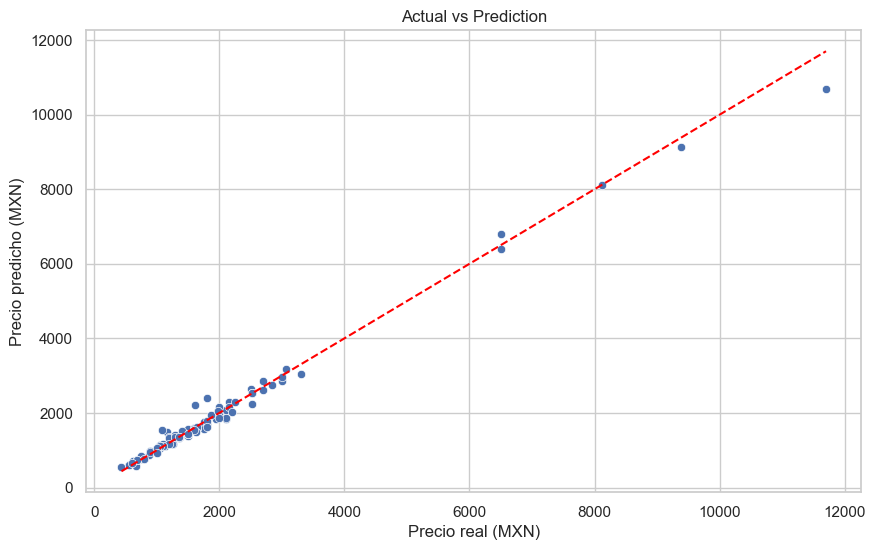
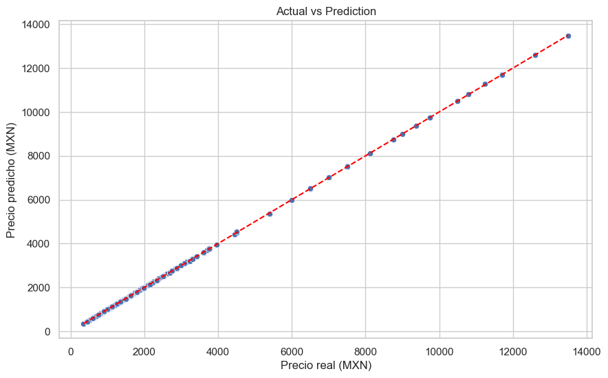

# Kanaa Price Prediction 🏠📈

Predict nightly prices from listing attributes using a clean, repeatable ML workflow.


---

## Regression Models in a Nutshell 🧠
Regression models estimate a **continuous value** (e.g., price, demand, sales) from input features. They learn a function that maps inputs to outputs while minimizing an error metric such as **Mean Absolute Error (MAE)** or **Root Mean Squared Error (RMSE)**. In practice, regression is the go-to approach for **numeric forecasting** problems where you want both **accuracy** and **explainability**.

### What Is a Regression Model? 📘
A regression model finds a relationship between variables by fitting a function of the form:

```
price = f(features) + noise
```

The goal is to approximate `f` so predictions generalize well to unseen data. This project uses both a **baseline regression** and a **tree-based ensemble model** for stronger performance.

---

## Models Used 🔧
- **Baseline regression** to establish a reference performance.
- **XGBoost Regressor** to capture non-linear relationships and interactions.
- **One-Hot Encoding** for categorical features like location and property type.
- **K-Fold Cross Validation** to verify stability and reduce overfitting risk.
- **Grid Search** to tune hyperparameters and improve generalization.

---

## Project Structure 🗂️
- `database.csv` — dataset (kept at project root)
- `best_xgb_model.pkl` — exported model (kept at project root)
- `01_training/` — EDA + baseline regression
- `02_model_selection/` — initial XGBoost model
- `03_hyperparameter_tuning/` — Grid Search for XGBoost
- `04_kfold_evaluation/` — K-Fold evaluation and model comparison
- `05_export/` — final export notebook to create the `.pkl`
- `06_server/` — Flask server entry point

---

## Notebooks by Phase 📒
- `01_training/kanaa-price-prediction.ipynb`
- `02_model_selection/kanaa-price-prediction-xgb.ipynb`
- `03_hyperparameter_tuning/kanaa-price-prediction-xgb-gridsearch.ipynb`
- `04_kfold_evaluation/kanaa-price-prediction-xgb-kfold.ipynb`
- `05_export/kanaa-price-prediction-xgb-export.ipynb`

---

## How to Run ▶️
1. Open the notebooks in order to reproduce the full workflow.
2. Ensure `database.csv` is in the project root.
3. When exporting, the model is saved to `best_xgb_model.pkl` in the project root.

---

## Server 🧪
- Entry point: `06_server/main.py`
- Load the model from `../best_xgb_model.pkl` inside the server folder.

---

## The Problem This Solves (and the Phases) 🧩
We want to **estimate nightly price** from listing characteristics (location, property type, rooms, bathrooms, guests, and occupancy). To solve that, the workflow is split into clear phases:

1. **Data Preparation & EDA** — clean the dataset, understand distributions, and define features.
2. **Baseline Modeling** — fit a simple regression model to establish a benchmark.
3. **Model Selection** — train XGBoost to capture non-linear structure.
4. **Hyperparameter Tuning** — run Grid Search for optimal configuration.
5. **K-Fold Evaluation** — validate stability across multiple folds.
6. **Export** — save the best model for production use.

---

## Notes 📌
- All notebooks reference the dataset using `../database.csv` so they work from their phase folder.
- If you retrain and export, the `best_xgb_model.pkl` file will be overwritten.

---

## Model Comparison 📊
A high-level comparison of the models used across phases (qualitative summary):

| Model | Purpose | Strengths | Tradeoffs | Status |
|---|---|---|---|---|
| Baseline Regression | Establish a simple benchmark | Fast, interpretable | Limited non-linear capacity | ✅ Used in training phase |
| XGBoost (Initial) | Capture non-linear patterns | Strong accuracy, handles interactions | More complex, less interpretable | ✅ Used in model selection |
| XGBoost (Tuned) | Improve generalization | Better bias–variance balance | Longer training time | ✅ Used in hyperparameter tuning |
| XGBoost (K-Fold Validated) | Validate stability | Robust to data splits | More compute, slower evaluation | ✅ Used for final evaluation |

---

## Prediction Plots Across Phases 📈
Below are the **actual vs. predicted** plots from each phase so readers can see how the fit improves over time:

<table>
  <tr>
    <td align="center">
      <strong>01 Training (Baseline)</strong><br/>
      
    </td>
    <td align="center">
      <strong>02 Model Selection (Initial XGBoost)</strong><br/>
      
    </td>
  </tr>
  <tr>
    <td align="center">
      <strong>03 Hyperparameter Tuning (Best Model)</strong><br/>
      
    </td>
    <td align="center">
      <strong>04 K-Fold Evaluation (Final)</strong><br/>
      
    </td>
  </tr>
</table>

---

## Conclusion ✅
The workflow shows that **tree-based models (XGBoost)** capture complex, non-linear relationships in pricing data better than a simple baseline. After tuning and K-Fold validation, the final model provides **stable and reliable predictions** suitable for deployment.
